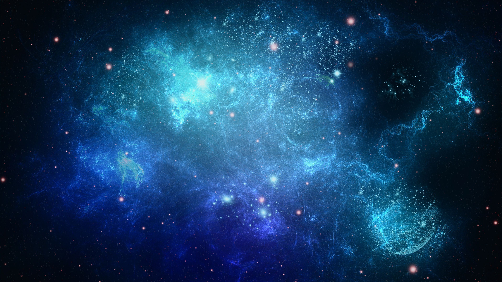
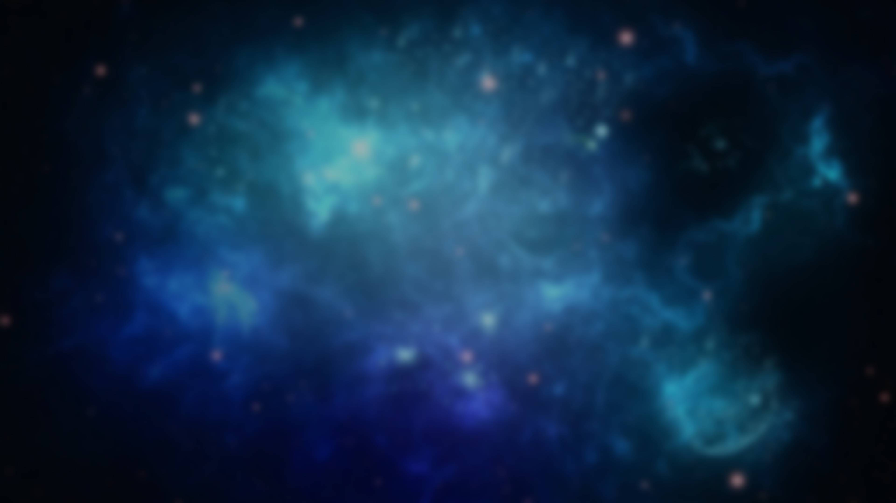

# About this blog
This blog uses the Jekyll theme [Just the Docs](https://pmarsceill.github.io/just-the-docs/), with some custom additions (like backlinks) and heavy CSS alterations, hosted with Github Page.

Locally, I edit these posts with [Obsidian](https://obsidian.md/).

The background image comes from [here](https://i.pinimg.com/originals/f6/20/a1/f620a179ca1acfd15a0754701677fb58.jpg)

which I dimmed and applied 15 pixels of gaussian blur, resulted in [this](https://i.imgur.com/C90lb3z.jpg)

The contents of this blog mainly comes from what I've written privately in my own notebook (Evernote) throughout the years.

